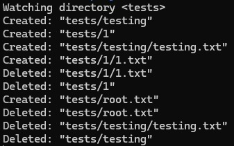
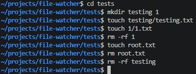

# file-watcher

A recursive filesystem watcher for Linux, written in C++ using the inotify kernel API.

Monitors a directory and all its subdirectories for file and folder changes in real time. New subdirectories created at runtime are automatically watched without restarting.

## Demo




## Features

- Recursively watches a directory and all nested subdirectories
- Detects file and folder creation and deletion
- Dynamically adds watches for newly created subdirectories at runtime
- Uses Linux's native inotify API for efficient kernel-level event notification
- Tracks watched directories with an `unordered_map` mapping watch descriptors to paths

## Requirements

- Linux (inotify is Linux-only)
- g++ with C++17 support

## Build

```bash
g++ -std=c++17 main.cpp -o file-watcher
```

## Usage

```bash
./file-watcher <directory>
```

**Example:**

```bash
./file-watcher ~/projects/my-project
```

**Output:**

```
Watching directory <~/projects/my-project>
Created: "~/projects/my-project/notes.txt"
Created: "~/projects/my-project/subdir"
Created: "~/projects/my-project/subdir/file.txt"
Deleted: "~/projects/my-project/notes.txt"
```

## How it works

inotify is a Linux kernel subsystem that notifies user-space programs of filesystem events. This tool:

1. Calls `inotify_init()` to create an inotify instance (returns a file descriptor)
2. Walks the target directory tree using `std::filesystem::recursive_directory_iterator` and registers an `inotify_add_watch()` on each subdirectory, storing each watch descriptor → path pair in an `unordered_map`
3. Blocks on `read()` waiting for events, then walks the returned buffer casting raw bytes to `inotify_event` structs
4. Looks up the watch descriptor in the map to reconstruct the full path of the changed file
5. On `IN_CREATE | IN_ISDIR`, dynamically registers a new watch for the created subdirectory and inserts it into the map

## Notes

- inotify does not work reliably on WSL paths under `/mnt/c/` (Windows filesystem mounts) — run on a native Linux filesystem or WSL home directory (`~/`)
- Events watched: `IN_CREATE`, `IN_DELETE`, `IN_CLOSE_NOWRITE`